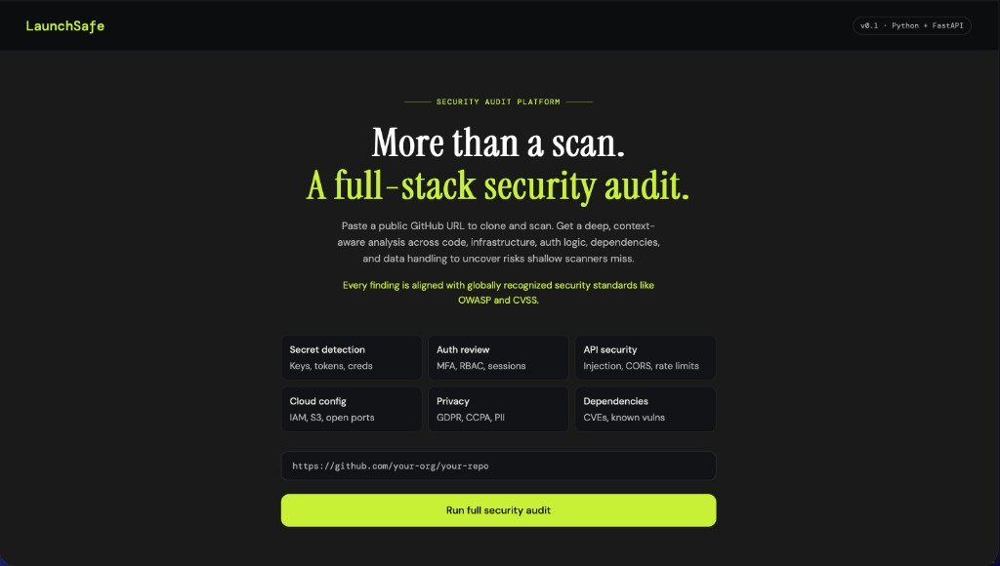
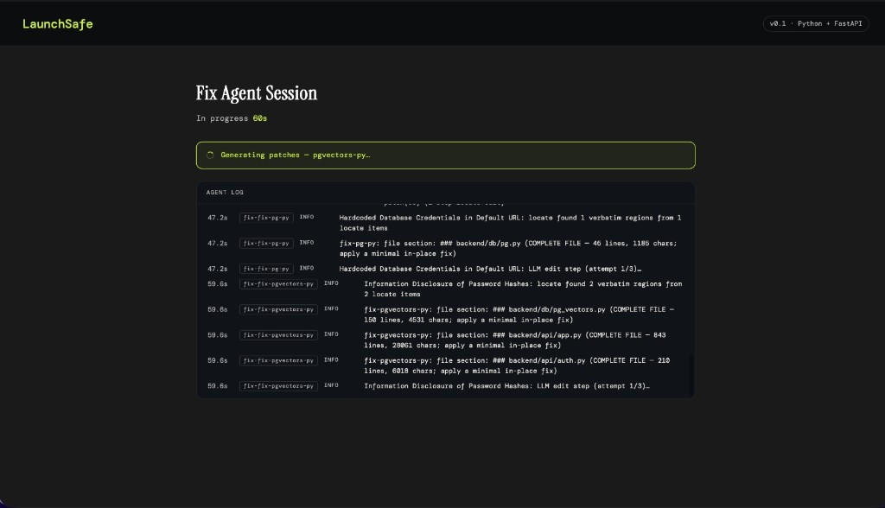
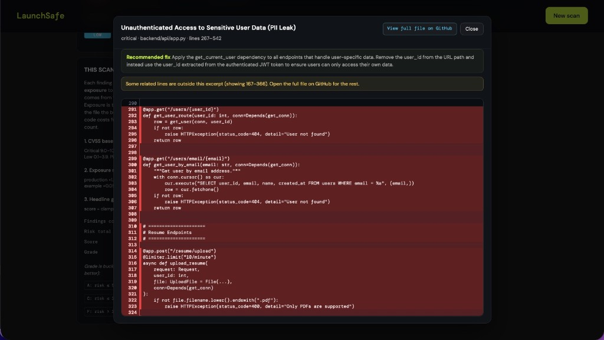
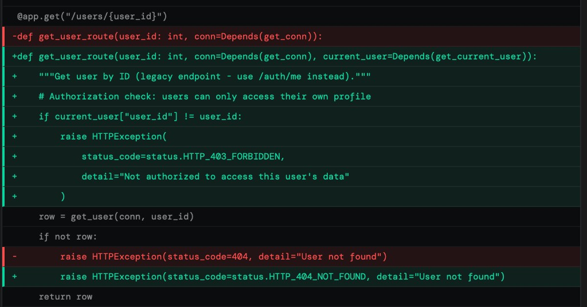
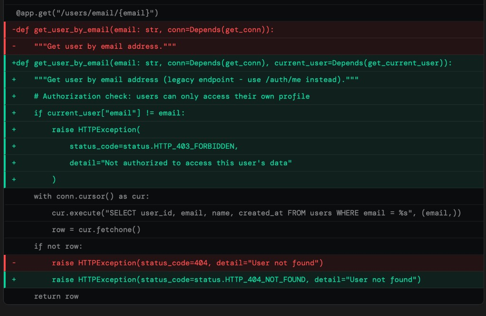
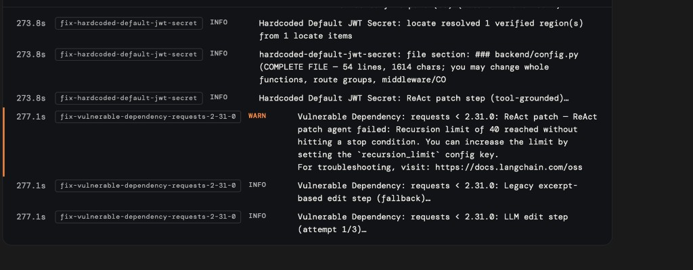

# LaunchSafe — Startup Security Auditor

LaunchSafe clones a GitHub repo and produces a prioritized, CVSS-scored security report in a few minutes. A **multi-agent LangGraph** pipeline profiles the repo, fans out **specialist** sub-agents on the hotspots that matter, then **synthesizes** deduped findings with an executive summary.

Optional **Fix mode** proposes concrete patches: semantic locate → **tool-grounded ReAct edit** (read/search the ingested snapshot, then structured patches) → legacy excerpt-based edit on fallback → review, with server-side sanity checks and quality gates so empty or unsafe diffs are surfaced clearly.

**Expect several minutes per full scan** (often ~3–10 minutes depending on repo size and LLM limits).

## Web UI

Landing page — paste a public GitHub URL (or upload a zip from the same flow) to run a full audit:



## What it checks

| Specialist   | Focus                                                                      |
|--------------|----------------------------------------------------------------------------|
| `recon`      | Profiles the repo: language, framework, payments / IaC / auth / CI flags   |
| `payments`   | Stripe / PCI exposure, webhook signature verification, key handling        |
| `iac`        | Terraform / K8s / Docker — public buckets, exposed DBs, IAM wildcards      |
| `auth`       | Login, session, JWT, password hashing, RBAC / IDOR                         |
| `cicd`       | GitHub Actions / GitLab CI — secrets, untrusted PR triggers, OIDC          |
| `general`    | Secrets, crypto, SQLi, SSRF, deserialization, CORS, dependency CVEs            |
| `synthesize` | Dedupes across branches, writes the executive summary + top fixes            |

Each finding gets a CVSS v3.1-aligned base score and a deployment-context **exposure** tag (`production` / `internal` / `test` / `example` / `doc`) so test-only noise does not dominate the grade.

## Architecture (scan)

```
FastAPI (backend/main.py)
/start-scan  /scan-status  /report/<id>
        │
        ▼
 LangGraph orchestrator
        │
     ┌──┴──┐
     │recon│  ← mini ReAct agent (list_files, read_files)
     └──┬──┘
        │  RepoProfile + flags
        ▼
route_after_recon  (conditional fan-out)
 ┌──────┬──────┬──────┬──────┐
 ▼      ▼      ▼      ▼      ▼
payments iac  auth  cicd  general   ← parallel ReAct sub-agents
 └──────┴──────┴──────┴──────┘
        │
        ▼
   synthesize  ← dedupe + executive summary LLM
        │
        ▼
   Report JSON (+ stashed source for fix mode)
```

Sub-agents stream **think → tool → result** style events to the UI over `/scan-status`, so branches show live progress.

## Fix mode (patch proposals)

From the report UI you can start a **fix session** (`/start-fix` → `/fix/<id>`). A separate LangGraph run:

1. **Plan** — batches findings into groups (per file / limits on group size).
2. **Locate + edit** — map findings to **verified** code spans (routes, symbols, fuzzy alignment when line numbers drift), then apply fixes. The **edit** step prefers a **ReAct loop** (`list_repo_files`, `grep_repo`, `fix_read_file` / `fix_read_files`) so the model grounds patches in files it actually read; if grounding fails or the subgraph hits its step cap, it **falls back** to the previous single-shot edit (full excerpts in the prompt). Patches can be **large** (whole handlers, middleware, app setup) when the issue requires it.
3. **Review** — optional batch review; the API also runs **quality gates** (e.g. substantive patches vs explanation-only, refusal language without repo evidence, `tests_touched` for substantive non-manifest diffs).

The backend rejects edits that obviously drop **returns** / **raises** / **HTTPException** without an equivalent replacement. Unified diffs are normalized for the UI (proper newlines).

### Screenshots

Live **fix session** log (locate → edit attempts) and **report** finding detail:





Example **patches** produced for IDOR-style issues (auth dependency + ownership check):





ReAct step hitting the LangGraph **recursion limit** (default kept low for shorter runs); the worker then uses **legacy excerpt-based edit**:



## Quick start

```bash
git clone https://github.com/SahibKazimli/LaunchSafe.git
cd LaunchSafe

python3 -m venv venv
source venv/bin/activate   # Windows: venv\Scripts\activate
pip install -r backend/requirements.txt

# Create backend/.env with at least ANTHROPIC_API_KEY or GEMINI_API_KEY
# (optional: LAUNCHSAFE_LLM_MODEL, see core/config.py)

cd backend
uvicorn main:app --reload
# → http://127.0.0.1:8000
```

### Frontend (Vite + TypeScript)

Scan, report, and fix pages use TS under `frontend/src/`. For development, run Vite and keep the API on **8000** — Vite proxies API routes.

```bash
cd frontend && npm install && npm run dev
# → http://127.0.0.1:5173
```

Proxied paths include `/start-scan`, `/scan-status`, `/start-fix`, `/fix-status`, `/fix-patches`, and `/debug/*`.

### Tests

```bash
cd backend && python -m pytest tests/ -q
```

## Configuration (high level)

Tunables live in `backend/core/config.py` and use the `LAUNCHSAFE_*` env prefix. Examples:

- **`LAUNCHSAFE_LLM_MODEL`** — Claude or Gemini model id (provider is inferred from the name).
- **`LAUNCHSAFE_FIX_PATCH_MAX_TOKENS`** — output budget for patch generation.
- **`LAUNCHSAFE_FIX_MAX_CONCURRENT_PATCH_GROUPS`** — parallel fix groups.
- **`LAUNCHSAFE_FIX_PROMPT_NARROW_TO_CITED`** — `0` (default) uses wider excerpts when cited lines may be stale; set `1` to prefer narrow windows on huge files.
- **`LAUNCHSAFE_FIX_PATCH_REACT_RECURSION_LIMIT`** — LangGraph super-steps for the patch ReAct subgraph (default **22**; lower = faster, more likely fallback; raise if groups often need extra tool rounds).
- **`LAUNCHSAFE_FIX_PATCH_REACT_ENABLED`** / **`LAUNCHSAFE_FIX_PATCH_REACT_FALLBACK_LEGACY`** — toggle tool-grounded edit and excerpt fallback (defaults `1`).

## Repo layout

```
LaunchSafe/
├── README.md
├── docs/
│   └── images/            # README screenshots
│       ├── landing-page.png
│       └── fix-mode/
├── Dockerfile
├── .dockerignore
├── backend/
│   ├── main.py                 # FastAPI app, static mounts
│   ├── requirements.txt
│   ├── tests/                  # pytest (fix validators, locate helpers, diff formatting)
│   ├── core/
│   │   ├── routes.py           # HTTP: scan, report, fix, debug
│   │   ├── orchestrator.py     # scan LangGraph driver
│   │   ├── fix_orchestrator.py # fix LangGraph driver + quality gates
│   │   ├── config.py           # LAUNCHSAFE_* knobs
│   │   ├── finding_files.py    # finding → file excerpts for fix prompts
│   │   └── ...
│   └── agents/
│       ├── graph.py            # scan StateGraph
│       ├── fix/                # fix plan / locate / edit / review graph
│       ├── prompts/            # specialist + fix prompts
│       ├── synthesize.py
│       ├── specialists.py
│       └── tools/              # ingest, scanners, AI tools, agent_tools
└── frontend/
    ├── src/                    # TypeScript (scan, report, fix UI)
    ├── index.html, scan.html, report.html, fix.html
    └── vite.config.ts
```

## Risk scoring

```
contribution = cvss_base × exposure_multiplier        # per finding
risk_total   = Σ contribution (only is_true_positive=True findings)
score        = clamp(100 − 2 × risk_total, 0, 100)
```

Exposure multipliers: `production 1.00`, `internal 0.60`, `test 0.15`, `example 0.05`, `doc 0.03`.

Grade buckets on `risk_total` (lower = better):

| risk_total | grade |
|------------|-------|
| ≤ 5        | A     |
| ≤ 12.5     | B     |
| ≤ 20       | C     |
| ≤ 30       | D     |
| > 30       | F     |

## Tech stack

- **FastAPI** + **Jinja2** — API and HTML shells
- **Vite** + **TypeScript** — scan / report / fix client
- **LangGraph** — scan and fix orchestration
- **LangChain** — LLM adapters (**Anthropic** and/or **Gemini** via config)
- **Pydantic** — findings, reports, fix plan / patch schemas
- **GitPython** — repo cloning
- **python-dotenv** — environment loading
- **pytest** — backend tests
